## Introduction et prise en main de R et RStudio

R est un langage de programmation et un environnement pour l'analyse de données et les statistiques. Il est largement utilisé en recherche, en sciences des données et en statistiques appliquées. Ce cours fournit une introduction aux bases de R, en mettant l'accent sur les applications statistiques.


---

### Sommaire

1. [Les outils R et RStudio](#1-les-outils-r-et-rstudio)
   - [1.1 Installation de R](#11-installation-de-r)
   - [1.2 Installation de RStudio](#12-installation-de-rstudio)
   - [1.3 Configurationn de RStudio](#13-configuration-de-rstudio)
2. [Les projets sous R avec RStudio](#2-les-projets-sous-r-avec-rstudio)
3. [Ecrire un script sur RStudio](#3-ecrire-un-script-sur-rstudio)
    - [3.1 Script Quarto](#31-script-quarto)
    - [3.2 Script R](#32-script-r)
4. [Bases du langage R](#4-bases-du-langage-r)
5. [Importation et manipulation des données](#5-importation-et-manipulation-des-données)
6. [Ressources](#6-ressources)

---

### 1. Les outils R et RStudio

### 1.1 Installation de R

**R** : Rendez-vous sur le site officiel [CRAN](https://cran.r-project.org/). pour télécharger et installer **R**.

- Pour toutes les personnes utilisant **Linux**, choisissez la bonne page entre parenthèses et suivez les consignes pour télécharger et installer R.
- Pour les personnes utilisant **MacOS**, téléchargez l’installateur en fonction de votre système et lancez-le.
- Pour les personnes utilisant **Windows**, téléchargez l’installateur en cliquant sur `install R for the first time` puis lancez-le. Vous devez aussi installer [**Rtools**](https://cran.r-project.org/)  via le lien sur le CRAN **ou** en utilisant les lignes de code suivantes dans **R** : 

```r
install.packages("utils")
install.packages("installr")
installr::install.Rtools()
```

### 1.2 Installation de RStudio

Rstudio est un IDE.

> En programmation informatique, un IDE (environnement de développement) est un ensemble d'outils qui permet d'augmenter la productivité des programmeurs qui développent des logiciels. 
> Source : [Wikipédia](https://fr.wikipedia.org/wiki/Environnement_de_d%C3%A9veloppement)

Dans cette partie vous allez apprendre à installer **RStudio**, l’environnement dans lequel vous allez coder en **R**.

**RStudio** : L'interface utilisateur graphique que vous allez utiliser pour travailler avec **R**. Téléchargez-le depuis [RStudio](https://posit.co/download/rstudio-desktop/). Choisissez bien l’installateur associé à votre système d’exploitation et suivez les consignes.


### 1.3 Configuration de RStudio

Dans cette partie nous allons apprendre à personnaliser RStudio de sorte à avoir un environnement de travail agréable à utiliser.​

Lorsque que vous ouvrez RStudio pour la première fois, votre écran doit ressembler à ça. 

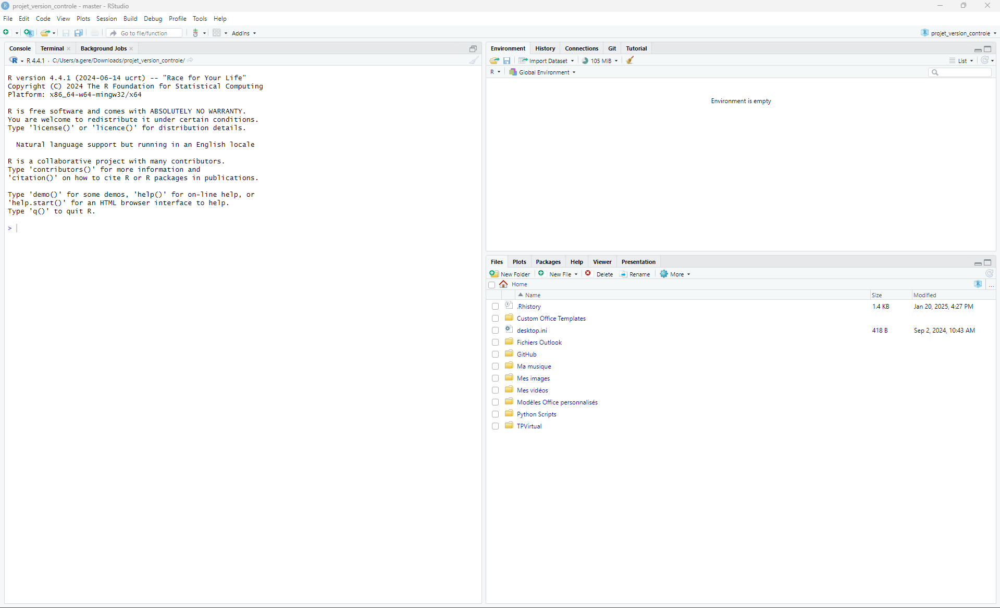

Les versions de R et RStudio peuvent être legerement différentes, donc quelques différences sont possibles entre ce que vous avez sur votre ordinateur et ce que vous pouvez observer sur cette capture d'écran.

L’organisation de ces parties est complètement modulable à votre guise dans :

```Tools > Global options```

Nous allons débuter par personaliser le _Pane Layout_.

```Tools > Global options > Pane Layout```

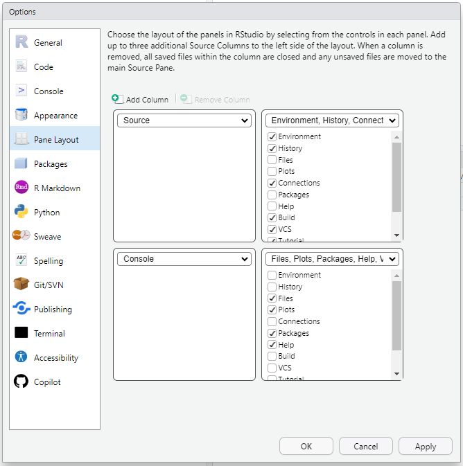

- En haut à gauche vous avez la fenêtre **Source**, là où les scripts s’ouvriront.
- En haut à droite la fenêtre  **Environnement,  History,  Connections, VSC, Tutorial, Presentation**. Sélectionnez :
    - Environnement
    - History
    - Connections 
    - Build
    - VCS
    - Tutorial : Cet onglet va vous permettre d’accéder à un ensemble de tutoriels très pratique pour apprendre à coder en R. 
- En bas à gauche la fenêtre **Console**, pour le moment avec Terminal et Background Jobs. Vide à chaque ouverture de RStudio, cette fenêtre est l’endroit où les codes vont être activés.
- En bas à droite la fenêtre **Files, Plots, Packages, Help, Viewer, Presentations**. Sélectionnez :
    - Files
    - Plots
    - Packages
    - Help
    - Viewer
    - Presentations

Nous allons à présent ajuster l’apparence de RStudio suivant nos propres préférences. Le chemin pour ces modification est toujours le même :

```Tools > Global options```

Nous commençons par **R General** :

```Tools > Global options > R General```

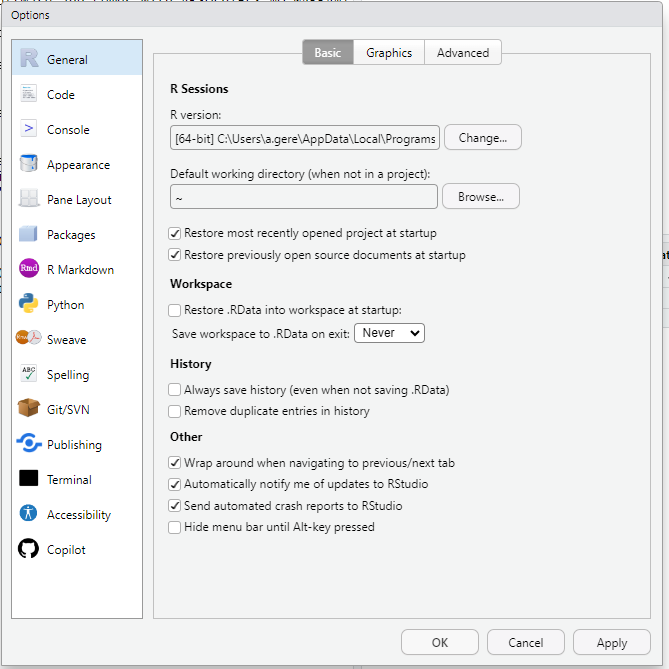

- Vérifiez si la version préente est la dernière en cliquant sous _R version_ sur **Change**.
- Workspace : Décocher _Restore .RData into workspace at startup_, de même choisissez **Never** pour _Save workspace to .RData on exit_.
- History : Laissez décochés les deux paramètres.
- Other : Laissez cochés les trois premiers paramètres.

Nous passons à **Code/Editing** :

```Tools > Global options > Code > Editing```

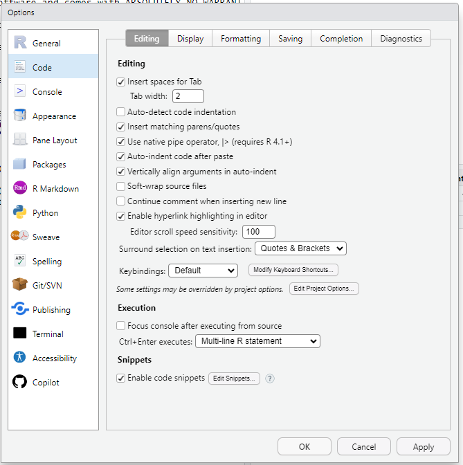

Sélectionnez _Use native pipe operator_

Nous passons à **Code/Display** :

```Tools > Global options > Code > Display```

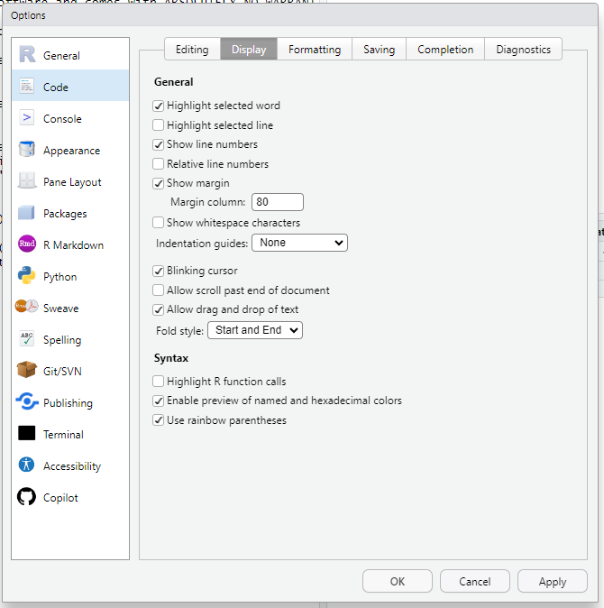

Sélectionnez _Use rainbow parentheses_

Nous passons à **Appearance** :

```Tools > Global options > Appearance```

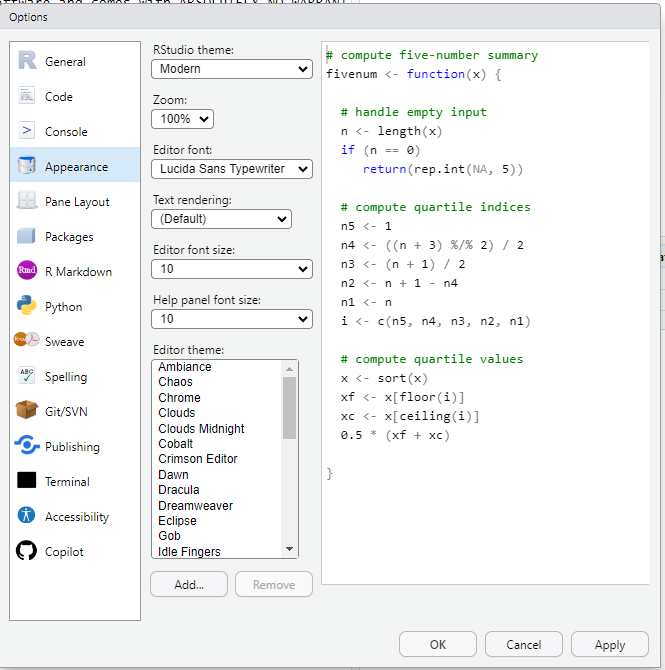

A vous de sélectionner les options qui vous conviennent le mieux !

> Ne pas oublier de cliquer sur **apply** !

Afin de vérifier si vous avez la bonne version, vous pouvez rentrer dans la Console

```r
sessionInfo()
```
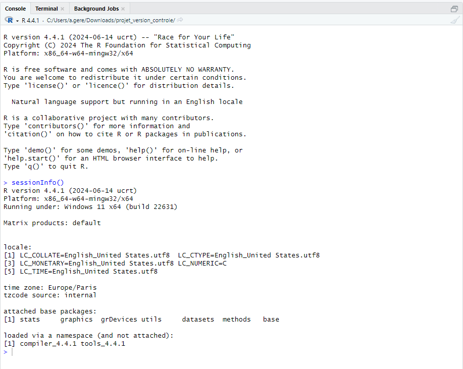

---

### 2. Les projets avec RStudio

Un projet centralise les éléments de travail et facilite la compréhension et la réutilisation du code. Un projet, c’est une manière de travailler qui va vous permettre d’écrire du code, mais pas que. En effet, un projet RStudio est globalement un dossier informatique dans lequel se trouvent des données, des scripts mais aussi de la documentation, des images et tout ce qu’il vous faut pour travailler. Lorsqu’on travaille sous forme de projet, il n’y a pas d'interaction involontaire entre les codes de différents projets.

> **Maintenir les packages R et Rstudio à jour**.
>
> Les packages peuvent être mis à jour dans l'onglet Packages puis en cliquant sur Update ou dans le menu ````Tools > Check for Package Update````. **À faire au moins une fois par mois**.

Lors de la création d’un projet, le dossier ne contient que le fichier  .Rproj  , c’est le projet. Il est très fortement conseillé de créer des sous-dossiers :
- ```data_raw``` (qui regroupent toutes les données brutes)
- ```data``` (qui regroupent les données retravaillées)
- ```doc``` (de la documentation ou tout autre document utile)
- ```img``` (les images utiles à notre projet)

Nous allons à présent créer notre premier projet. Il y a plusieurs chemin pour créer un projet, tous sont équivalents. Une possibilité est de cliquer sur **Project** en haut à droite de votre fenêtre RStudio. 

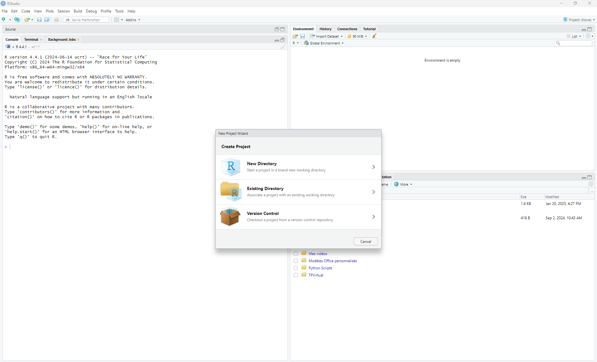

Vous avec alors la possibilité de créer un projet à partir d'un dossier vide ou existant. Nous choisirons pour cette prmière fois de créer un projet à partir d'un dossier vide. Nous créons **quatre sous dossiers** : ```data_raw```, ```data```, ```doc``` et ```img```.

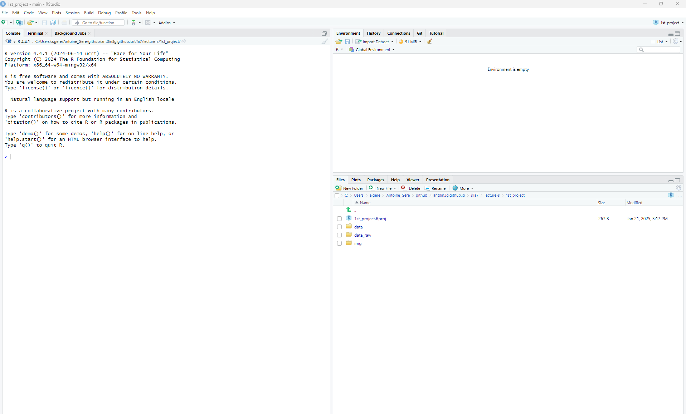

On peut alors observer dans le cadran en bas à droite :
- ```1st_project.Rproj```
- ```data``` 
- ```data_raw```
- ```doc```
- ```img```

---

### 3. Ecrire un script sur RStudio 

#### 3.1 Script Quarto 

**Quarto**, c’est la nouvelle génération de R markdown. De manière basique, vous pourrez générer des documents (qui intègrent ou pas du code R) dans les formats html, word ou pdf, mais avec plus de facilité pour gérer, par exemple, les images, les références croisées. Vous pourrez également réaliser des diapositives, des dashboards et des sites webs, des livres, comme R markdown mais nativement, c’est à dire sans faire appel à des packages complémentaires comme bookdown (livres), xaringan (slides), flexdasboard (dashboard).

Voici un rapide tour d’horizon de la syntaxe, pour plus d’informations :

- Le saut de ligne est marqué par un double espace (en fin d’une ligne).
- Les étoiles servent à marquer : 
    - En italique :  ``` *italique* ```
    - En gras :  ``` **gras** ```
    - En gras et italique :  ``` ***gras et italique*** ```
    - Pour raturer on utiliser les tildes :  ``` ~~raturé~~ ```
- Pour la syntaxe code les impostropes : ``` `code` ```
- Les titres sont précédés de#, autant que de niveaux : 
    - Titre de premier niveau :  ``` # Titre de premier niveau ```
    - Titre de deuxième niveau :  ``` ## Titre de deuxième niveau ```
    - Titre de troisième niveau :  ``` ### Titre de troisième niveau ```

Vous pouvez retrouver les principales syntaxes sur Markdown à cette [page](https://quarto.org/docs/authoring/markdown-basics). 

Nous allons créer notre premier script Quarto.

1. Créer un nouveau document Quarto ```File > New File > Quarto Document```
2. Pour cette premire fois choisissez les options suivantes :

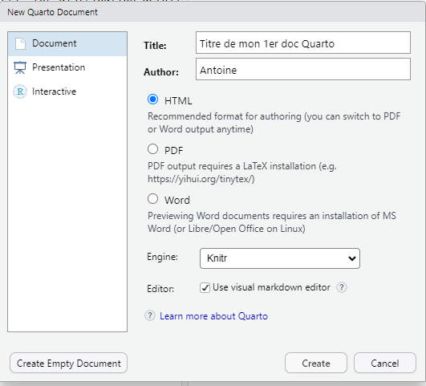

3. Vous allez probablement avoir besoin d'installer le package ``` Rmarkdown ```. Pour cela il vous suffit d'aller dans le cadran en bas à droite et de cliquer sur  ```Packages``` puis ```Install```. Une boite de dialogue s'ouvre :

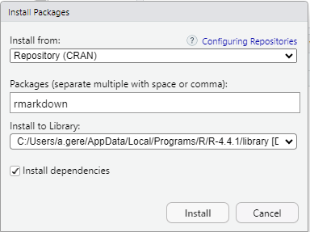

Cliquez sur **Install**, et enregistrez votre script. Le script Quarto apparrait alors dans le cadran en bas à droite dans la fenetre Files. Vous pouvez vous amuser avec ce script, lancer les morceaux de code R. Pour générer le document **html** cliquer sur la petite fleche bleue **Render the current document**, ou utilser le raccourci ```Ctrl + Shift + K```.

Si vous souhaitez modifier la le format de sortie, par exemple récupérer un pdf à la place d'un html, il vous suffit d'crire **pdf** à la place de **html** dans le code : fenetre en haut à gauche puis Source.

Un [ensemble d'exemple](https://quarto.org/docs/gallery/) de ce qui est possible de faire avec **Quarto**.

#### 3.2 Script R

Nous allons créer notre premier script R.

- Créer un nouveau document Quarto ```File > New File > R Script```
- Enregistrer votre script
- Ecrivez votre première ligne de code sur R :
```r
2 + 3
```
- Enregistrez votre script
- Cliquer sur Run, en haut à droite du cadran en haut à gauche.

> Dans la partie suivante nous allons voir les bases du language R.

---

### 4. Bases du langage R

Nous allons travailler dans notre script  R.

#### 4.1 Obtenir de l’aide sur R

Le système d'aide en ligne fourni avec **R** est accessible via la commande ```help()```. Lorsque l'on connaît le nom de la commande **R**, par exemple, ```cmd```, on peut taper ```help(cmd)``` ou ```?cmd``` (sauf dans le cas de certains opérateurs). Sinon, on peut rechercher à partir de mots-clés en tapant ```help. search()```. Une alternative pour la recherche par motif consiste à utiliser ```apropos()```. Pour connaître toutes les commandes fournies par un package (e.g., ```pkg```), il suffit de taper ```help(package=pkg)```.

#### 4.1 Quelques premières notions

Nous avons vu que R peut effectuer des opérations mathématiques. Par exemple :

```r
2 + 3
```

ou encore

```r
2 * 3
```

Pour récupérer du texte en sortie, il est nécesaire de l'écrire de cette façon :

```r
"ISTOM, Ecole supérieure d'agro-développement international"
```

Sans les guillemets R retourne une erreur.

En revanche pour récupérer des nombres en sortie, il suffit simplement de rentrer ces nombres :

```r
105
8
89
2576
978364
```

Afin d'ajouter des commentaires dans votre code (tres fortement conseillé), il suffit d'écrire :

```r
# L'école la plus cool ;-)
"ISTOM, Ecole supérieure d'agro-développement international"
```

Il est très souvent utile de créer des variables. Cela se fait de la manière suivante

```r
ecole <- "ISTOM"
adresse <- "4 Rue Joseph Lakanal, 49000 Angers"
date_creation <- 1908
```

De cette façon si ensuite vous rentrez 

```r
ecole
```

il vous sortira simplement **ISTOM**. 

On peut également manipuler ces variables. Par exemple :

```r
paste("L'",ecole,"a été créée en",date_creation) 
```

ou encore

```r
date_creation <- 1908
nombre_etudiant_promotion <- 60

(2025-date_creation)*nombre_etudiant_promotion
```

On peut attribuer la même valeur à plusieurs variables.

```r
var1 <- "Angers"
var2 <- "Angers"
var3 <- "Angers"

var1
var2
var3
```

#### 4.2 Les différents types de données

Il existe différents types de données sur R, on peut citer :
- ```numeric``` - (10.5, 55, 787)
- ```integer``` - (1L, 55L, 100L, où le "L" informe R que c'est un integer)
- ```complex``` - (9 + 3i)
- ```character / string``` - ("k", "Les stat c'est cool", "FALSE", "11.5")
- ```logical / boolean``` - (TRUE or FALSE)

On peut vérifier le type de donnée d'une variable en utilisant la fonction ```class()```.

```r
# numeric
x <- 10.5
class(x)

# integer
x <- 1000L
class(x)

# complex
x <- 9i + 3
class(x)

# character/string
x <- "R is exciting"
class(x)

# logical/boolean
x <- TRUE
class(x) 
```

Il y a trois types de nombres : ```numeric```, ```integer``` et ```complex```. On peut convertir un nombre d'un type à un autre en utilsant les fonctions :
- ```as.numeric()```
- ```as.integer()```
- ```as.complex()```

Plusieurs fonctions utiles pour les ```character / string``` :
- Connaitre la longueur d'une string : ```nchar(ecole)```
- Savoir si une string est contenue dans une autre string : ```grepl("I",ecole)```
- Regrouper deux strings : paste("Cette ecole a été créée en",date_creation) 

En ce qui concerne les vraiables ```logical / boolean``` on a simplement :
```r
10 > 9    # TRUE car 10 est plus grand que 9 !
10 == 9   # FALSE car 10 n'est pas egale à 9 !
10 < 9    # FALSE car 10 est plus grand que 9 ! 
```

Quelques outils d'arithmétques :
```r
2 + 3 # Addition 	
2 - 3 # Subtraction 	
2 * 3 # Multiplication 	
2 / 3 #	Division
2^3 # Exponent
```

Quelques outils de comparaison 
```r
3 == 3 # Check if equal 	
5 != 3 # Check if not equal	
5 > 3 # Check if 5 is greater than 3	
5 < 3 # Check if 5 is less than 3 
5 >= 3 # Check if 5 is greater than or equal to 3
5 <= 3 # Check if 5 is less than or equal to 3
```

On peut ranger ces données dans différents objets :

- **Vecteurs** : Une séquence d'éléments du même type.
```r
x <- c(55, 1, 2, 3, 4)
x
length(x)
sort(x)
x[3]
x[c(1,3)]
x[c(-1)]
x[4] <- 100 
x
```
-**Listes** : Une séquence d'éléments qui peuvent être différents.
```r
ma_liste <- list("apple", "banana", "cherry")
ma_liste
ma_liste[1]
ma_liste[2] <- "pineapple"
length(ma_liste)
"apple" %in% ma_liste 
append(ma_liste,"orange",after=3)
```
- **Matrices** : Tableau à deux dimensions.
```r
mat <- matrix(1:9, nrow = 3, ncol = 3)
mat
mat[1,2]
mat[1,]
mat[,2]
mat[c(1,2),] 
mat[,c(1,2)] 
mat_add_column <- cbind(mat,c(50,8,47))
mat_add_column
mat_add_row <- rbind(mat,c(50,8,47))
mat_add_row
mat_remove_line_column_one <- mat[-c(1), -c(1)]  #Remove the first row and the first column
mat_remove_line_column_one
dim(mat)
```
- **Data frames** : Tableau avec colonnes pouvant contenir différents types de données.
```r
df <- data.frame(
    Age = c(25, 30, 35), 
    Sexe = c('Homme', 'Femme', 'Homme'))
df
summary(df)
df[1]
df[["Age"]]
```
- **Facteurs** : c'est un vecteur dont les éléments ne peuvent prendre que des modalités prédéfinies. Ce qui caractérise un facteur dans **R** est le fait qu’elle dispose de l’attribut Levels (niveaux). En pratique, un facteur est typiquement utilisé pour stocker les valeurs observées d’une variable catégorielle (couleur, sexe, jours de la semaine, religion, ...).
```r
music_genre <- factor(c("Jazz", "Rock", "Classic", "Classic", "Pop", "Jazz", "Rock", "Jazz"))
music_genre
levels(music_genre) 
length(music_genre) 
music_genre[3] 
music_genre[3] <- "Pop"
music_genre
```

#### 4.3 Conditions, boucles

##### 4.3.1 If ... Else

Le mieux est d'illustrer ceci sur un exemple :
```r
a <- 200
b <- 33

if (b > a) {
  print("b is greater than a")
} else if (a == b) {
  print("a and b are equal")
} else {
  print("a is greater than b")
}  
```

##### 4.3.2 Nested If 

Sur un exemple :
```r
x <- 41

if (x > 10) {
  print("Above ten")
  if (x > 20) {
    print("and also above 20!")
  } else {
    print("but not above 20.")
  }
} else {
  print("below 10.")
} 
```

##### 4.3.3 AND, OR

Un exemple pour **AND**
```r
a <- 200
b <- 33
c <- 500

if (a > b & c > a) {
  print("Both conditions are true")
} 
```

Un exemple pour **OR**
```r
a <- 200
b <- 33
c <- 500

if (a > b | a > c) {
  print("At least one of the conditions is true")
}
```

##### 4.3.4 Loops

**R** a deux commandes pour les boucles :
- ```while``` loops
- ```for``` loops

```r
i <- 1
while (i < 6) {
  print(i)
  i <- i + 1
}
```

un autre exemple

```r
i <- 1
while (i < 6) {
  print(i)
  i <- i + 1
  if (i == 4) {
    break
  }
} 
```

Un dernier exemple pour illsutrer la fonction **next**
```r
i <- 0
while (i < 6) {
  i <- i + 1
  if (i == 3) {
    next
  }
  print(i)
} 
```

Un exemple pour une boucle ```for```
```r
fruits <- list("apple", "banana", "cherry")

for (x in fruits) {
  print(x)
} 
```
ou encore
```r
adj <- list("red", "big", "tasty")
fruits <- list("apple", "banana", "cherry")
  for (x in adj) {
    for (y in fruits) {
      print(paste(x, y))
  }
} 
```

#### 4.4 Les fonctions

Pour créer une fonction on écrit :
```r
 my_function <- function() { # create a function with the name my_function
  print("L'ISTOM c'est top!")
} 

my_function()
```

On peut créer des fonctions avec des arguments :
```r
ma_promo <- function(promo,groupe) {
  paste("Promotion", promo, "groupe", groupe)
}

ma_promo(114,"A")
ma_promo(115,"B") 
```

On a également :
```r
ma_multiplication <- function(x) {
  return (5 * x)
}

print(ma_multiplication(3))
print(ma_multiplication(5))
print(ma_multiplication(9)) 
```

#### 4.4 Les graphiques

Le mieux est d'encore de travailler sur des exemples. Pour tracer le point de coordonnées (1,3) on écrit :
```r
plot(1, 3) 
```

pour tracer les points de coordonnées (1,3) et (8,10) on écrit :
```r
 plot(c(1, 8), c(3, 10)) 
```

de la même façon on a :
```r
x <- c(1, 2, 3, 4, 5)
y <- c(3, 7, 8, 9, 12)

plot(x, y)
```

pour tracer les points (1,1), (2,2), (3,3), ..., (10,10) on peut écrire
```r
plot(1:10) 
```

si on veut tracer une ligne qui passe par ces points on écrit
```r
plot(1:10, type="l",lwd=2, lty=3) 
```
L'argument ```lwd``` permet de modifier l'epaisseur de la ligne tracée, sachant que 0.5 correspond à 50% et 2 à 200%. L'arguement ```lty``` permet de modifier le style de la ligne :
- 0 removes the line
- 1 displays a solid line
- 2 displays a dashed line
- 3 displays a dotted line
- 4 displays a "dot dashed" line
- 5 displays a "long dashed" line
- 6 displays a "two dashed" line


On peut affiner la présentation de notre graphique : 
```r
plot(1:10, main="My Graph", xlab="The x-axis", ylab="The y axis",col="green",cex=0.5,pch=11) 
```

L'argument ```cex``` permet de réduire ou augementer a taille des points, sachant que 0.5 correspond à 50% et 2 à 200%. L'argument ```pch``` permet de changer le style des points tracés, de 0 à 25 : 
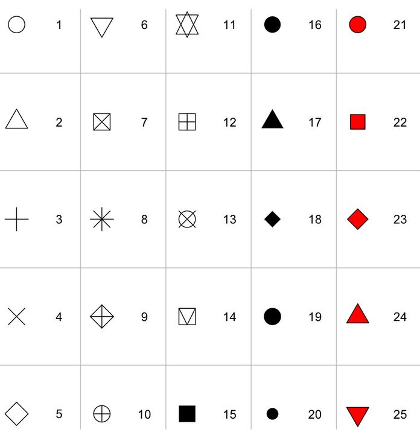


Un autre exemple 
```r
line1 <- c(1,2,3,4,5,10)
line2 <- c(2,5,7,8,9,10)

plot(line1, type = "l", col = "blue")
lines(line2, type="l", col = "red") 
```

Pour comparer des données sur un graphe :
```r
x1 <- c(5,7,8,7,2,2,9,4,11,12,9,6)
y1 <- c(99,86,87,88,111,103,87,94,78,77,85,86)

x2 <- c(2,2,8,1,15,8,12,9,7,3,11,4,7,14,12)
y2 <- c(100,105,84,105,90,99,90,95,94,100,79,112,91,80,85)

plot(x1, y1, main="mon titre", xlab="l'axe x", ylab="l'axe y", col="red", cex=2)
points(x2, y2, col="blue", cex=2)
```

**Pie Charts - Diagramme circulaire**

```r
x <- c(10,20,30,40)
mylabel <- c("Apples", "Bananas", "Cherries", "Dates")
colors <- c("blue", "yellow", "green", "black")
pie(x,, label = mylabel, main = "Fruits",col = colors,init.angle = 90) 
legend("bottomright", mylabel, fill = colors) 
```

**Bar Charts**

```r
x <- c("A", "B", "C", "D")
y <- c(2, 4, 6, 8)
barplot(y, names.arg = x, col = "red",density = 10,width = c(1,2,3,4))
barplot(y, names.arg = x, horiz = TRUE) 
```

---

### 5. Importation et manipulation des données

RStudio est l’environnement qui va vous permettre d’analyser vos données. Vous allez maintenant apprendre à charger des données dans RStudio, les modifier puis les ressortir de RStudio.

Nous allons apprendre à ouvrir un fichier CSV consacré que voustéléchargerez sur le site [open data](https://www.data.gouv.fr/fr/datasets/) du gouvernement. Choisissez un jeu de donnée qui vous interesse. Vous enregistrer ce fichier dans le dossier ```data_raw``` de votre projet sous R. Ce fichier CSV est un fichier texte où les données sous formes de tables sont séparées par des virgules. C’est le format de table par excellence à privilégier car nativement pris en compte par R, sans limite de lignes, contrairement à Excel. Pour ma part j'ai choisi ce [jeu de données](https://www.data.gouv.fr/fr/datasets/mixite-dans-le-groupe-edf/).

- Télécharger le jeu de données au format CSV
- Enregistrer ce fichier CSV dans le dossier ```data_raw``` de votre projet sous R
- Sous R, rentrer le code :  
```r
mixite_groupe_edf <- read.csv("data_raw/mixite-dans-le-groupe-edf.csv",sep = ";")
```
- Vous récupérer dans le cadran en haut à droite, dans Environment, l'ensemble des varaibles de votre fichier CSV


> Pour éviter les erreurs : Lisez la page d’aide avant d’utiliser une fonction pour la première fois grâce à la fonction ```help()```  ou l’onglet **Help**.

Ecrivez sous R
```r
> help("read.csv")
```
Vous récupérez dans le cadran en bas à droite la documentation de la fonction ```read.csv```.

> **Il est cependant fréquent que les données ne soit pas regroupées dans un fichier CSV, mais directement dans un fichier Excel.**

Il est nécessaire de charger le package ```readxl```. Deux possibilités s'offrent à nous, soit on procède comme précement pour le package ```rmarkdown```, soit on écrit sur la ligne de code suivante :
```r
install.packages("readxl")
```
Et maintenant nous allons charger les données d'un fichier excel récupérer sur [ce site](https://stats.mom.gov.sg/Pages/Occupational-Wages-Tables2022.aspx).
```r
library(readxl)
salaire <- read_excel("data_raw/mrsd_2022Wages_Occ_Ind_List.xlsx")
```
Cela ne fonctionne malheuresement pas très bien. Il est nécessaire de péciser l'onglet sur lequel on va travailler et les celules qui nous intéressent.
```{r}
library(readxl)
salaire <- read_excel("data_raw/mrsd_2022Wages_table4.xlsx", sheet = "T4", range = "B10:J352")
```
Enfin pour ajouter les titre de chacune des colonnes on écrit
```{r}
library(readxl)
salaire <- read_excel("data_raw/mrsd_2022Wages_table4.xlsx", sheet = "T4", range = "B10:J352", col_names = {
  c("SSOC 2020","Occupation","Number Covered","Basic Wage - 25th Percentile ($)", "Basic Wage - Median  ($)","Basic Wage - 75th Percentile ($)","Gross Wage - 25th Percentile ($)", "Gross Wage - Median  ($)","Gross Wage - 75th Percentile ($)")})
```


---

### 6. Ressources
- [Documentation officielle de R](https://cran.r-project.org/manuals.html)
- [Introduction à R par RStudio](https://posit.co/resources/)

---

Avec ce premier cours, vous êtes prêts à débuter votre exploration statistique avec **R**. Bonne analyse !

