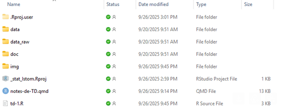
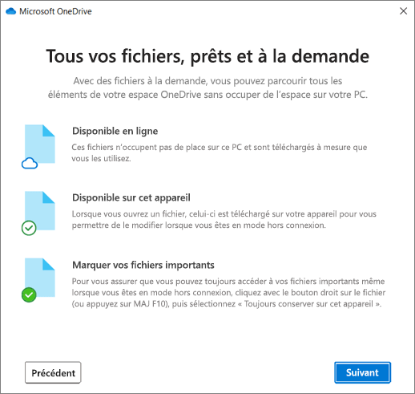

Afin de faciliter notre travail en travaux dirigés, je vous partage un dossier OneDrive.

  

Il vous ai demandé de synchroniser ce dossier OneDrive sur votre ordinateur personel.

###  Étapes de synchronisation d’un dossier partagé OneDrive sur Windows ou Mac



1. Vérifier OneDrive sur son PC
- Cliquer sur le bouton Démarrer et tape OneDrive
- Si OneDrive n’est pas installé, télécharger le depuis la page officielle Microsoft OneDrive
- Se connecter avec son compte Microsoft ISTOM

2. Accéder au dossier partagé
- Ouvre un navigateur internet (Firefox, Edge, Chrome, etc.)
- Se connecter sur [https://onedrive.live.com/login](https://onedrive.live.com/login)
- Dans le menu à gauche, cliquer sur Partagé
- Trouver le dossier que à synchroniser

3. Synchroniser le dossier à son OneDrive
- Ouvre le dossier partagé dans le navigateur
- En haut, clique sur le bouton Synchroniser
- L'application OneDrive va alors se lancer automatiquement
- Confirmer que vous souhaiter synchroniser ce dossier

4. Retrouver ce dossier synchronisé sur son ordinateur
- Ouvre Explorateur de fichiers (touche Windows + E)
- Dans le menu de gauche, il va apparaitre une rubrique ISTOM
- Le fichier sera alors présent dans cette rubrique ISTOM

### Convention sur la synchronisation des documents et dossiers sur OneDrive

  
